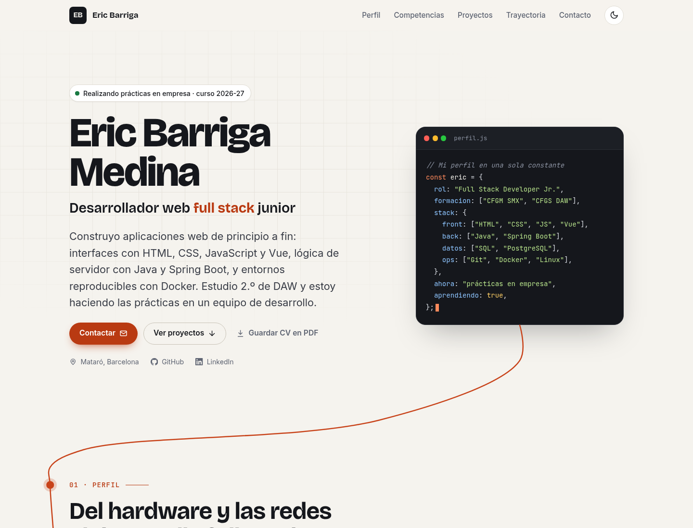
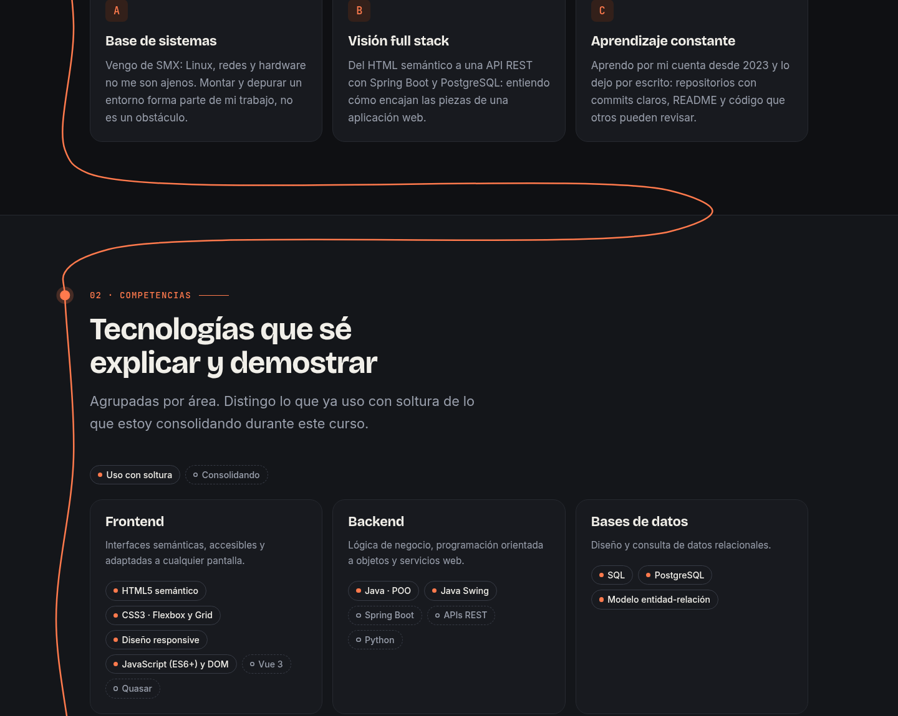
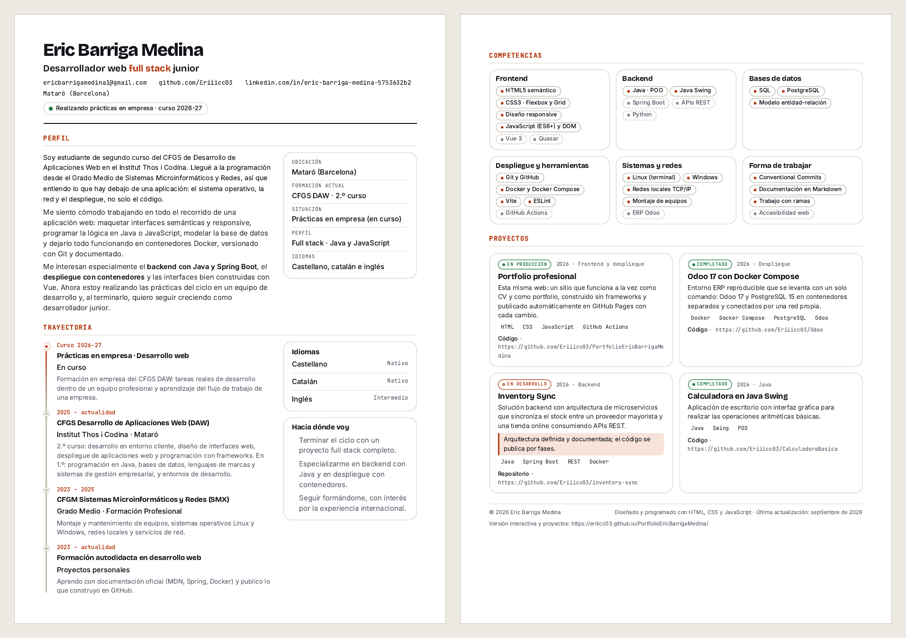

# Portfolio profesional · Eric Barriga Medina

[](https://github.com/Eriiicc03/PortfolioEricBarrigaMedina/actions/workflows/deploy.yml)


Web personal que funciona a la vez como **currículum** y como **portfolio**: permite a una empresa
entender mi perfil en pocos segundos y comprobar, con proyectos reales enlazados a su código,
lo que sé hacer. Un **hilo conductor** recorre toda la página: nace en mi código y se va dibujando
a medida que se baja, sección a sección, hasta llegar al contacto.

### 🔗 Web publicada: **[eriiicc03.github.io/PortfolioEricBarrigaMedina](https://eriiicc03.github.io/PortfolioEricBarrigaMedina/)**



---

## Índice

1. [Objetivo](#objetivo)
2. [La idea: el hilo conductor](#la-idea-el-hilo-conductor)
3. [Contenido de la web](#contenido-de-la-web)
4. [Tecnologías](#tecnologías)
5. [Características](#características)
6. [Estructura del proyecto](#estructura-del-proyecto)
7. [Cómo visualizarlo en local](#cómo-visualizarlo-en-local)
8. [Cómo editar la web a mano](#cómo-editar-la-web-a-mano)
9. [Despliegue](#despliegue)
10. [Flujo de trabajo con Git y versiones](#flujo-de-trabajo-con-git-y-versiones)
11. [Calidad y validación](#calidad-y-validación)
12. [Autor y licencia](#autor-y-licencia)

---

## Objetivo

Práctica **PR01 · Portfolio profesional** del módulo *0614 · Despliegue de aplicaciones web*
(CFGS Desarrollo de Aplicaciones Web, Institut Thos i Codina).

El objetivo es un sitio que:

- Transmita una **identidad profesional propia** y se consulte con comodidad desde el **móvil**.
- Sirva como **CV**: presentación, perfil, competencias, formación, idiomas y contacto.
- Aporte **evidencias verificables**: cada proyecto enlaza a su repositorio e indica qué competencias demuestra.
- Se mantenga **vivo**: está pensado para añadir proyectos nuevos en pocos minutos.

## La idea: el hilo conductor

Llegué al desarrollo web desde el Grado Medio de Sistemas Microinformáticos y Redes. Para contar ese
recorrido, una línea abstracta atraviesa la web de arriba abajo:

1. **Nace en la tarjeta de código** de la portada (`perfil.js`).
2. **Baja por el margen** de cada sección y **se enciende un nodo** cuando llega a su título.
3. Entre sección y sección **hace una curva o un bucle** por el espacio vacío, sin pisar nunca el texto.
4. **Termina subrayando "Hablemos."** en la sección de contacto.

La línea se va dibujando con el scroll, con un punto brillante en la punta y el camino pendiente en
punteado. Se recalcula sola si cambia el tamaño de la pantalla y respeta la opción de *reducir
movimiento* (en ese caso aparece dibujada entera).



## Contenido de la web

| Sección | Qué contiene |
| :-- | :-- |
| **Inicio** | Nombre, perfil profesional objetivo, estado actual, contacto directo y enlaces a GitHub y LinkedIn. |
| **01 · Perfil** | Presentación redactada para una empresa: qué sé hacer, qué me interesa y hacia dónde voy. |
| **02 · Competencias** | Tecnologías agrupadas por área, distinguiendo lo que uso con soltura de lo que estoy consolidando. |
| **03 · Proyectos** | Proyectos reales con enlace al código y la lista de competencias que demuestran, más las prácticas recientes del ciclo. |
| **04 · Trayectoria** | Formación (CFGS DAW, CFGM SMX, formación autodidacta), prácticas en empresa, idiomas y objetivos. |
| **05 · Contacto** | Correo (con botón para copiarlo), LinkedIn, GitHub y botón para descargar el CV en PDF. |

## Tecnologías

- **HTML5 semántico**: `header`, `nav`, `main`, `section`, `article`, `aside`, `footer`, listas de definición y jerarquía de títulos coherente.
- **CSS3 propio**, sin frameworks: variables, Grid, Flexbox, tipografía fluida con `clamp()`, `color-mix()`, `@media (prefers-color-scheme)`, `@media (prefers-reduced-motion)` y hoja de impresión.
- **SVG** generado con JavaScript para el hilo conductor (curvas de Bézier calculadas a partir de la posición real de cada sección).
- **JavaScript** (ES2020+) sin librerías.
- **GitHub Actions** + **GitHub Pages** para validar y publicar automáticamente.
- **html-validate** para comprobar el HTML en cada push.
- Fuentes autoalojadas: [Bricolage Grotesque](https://fonts.google.com/specimen/Bricolage+Grotesque), [Inter](https://rsms.me/inter/) y [JetBrains Mono](https://www.jetbrains.com/lp/mono/) (licencia SIL OFL 1.1).

No hay paso de compilación: el código del repositorio es exactamente el que se publica.

## Características

- 🧵 **Hilo conductor** que se dibuja con el scroll y enciende un nodo en cada sección.
- 📱 **Responsive *mobile-first***: probado en móvil (375–390 px), tableta (768–820 px) y escritorio (1024–1440 px).
- 🌗 **Tema claro y oscuro**: sigue la preferencia del sistema y recuerda la elección.
- 📄 **CV en PDF desde la propia web**: el botón *Guardar CV en PDF* usa `css/impresion.css` para generar un currículum A4 de dos páginas con las URL de los repositorios.
- ♿ **Accesible**: enlace para saltar al contenido, foco visible, menú móvil con `aria-expanded`, sección activa con `aria-current`, contraste AA, el hilo es decorativo (`aria-hidden`) y todo el contenido funciona **sin JavaScript**.
- ⚡ **Rápido**: fuentes propias con precarga y reservas ajustadas (sin saltos de maquetación); el hilo se mide con cálculos propios en lugar de pedirle al navegador punto por punto.
- 🔎 **SEO**: metadatos, Open Graph con imagen para LinkedIn, datos estructurados `schema.org/Person`, `sitemap.xml` y `robots.txt`.
- 🚧 **Página 404** personalizada.

<p align="center">
  
</p>

**CV generado con el botón «Guardar CV en PDF»:**



## Estructura del proyecto

```text
.
├── index.html                 # Toda la web: textos, proyectos, trayectoria...
├── 404.html                   # Página de error personalizada
├── css/
│   ├── fuentes.css            # Fuentes propias y fuentes de reserva
│   ├── variables.css          # Colores, tamaños y espacios (tema claro y oscuro)
│   ├── base.css               # Estilos de las etiquetas HTML y utilidades
│   ├── estructura.css         # Cabecera, portada, secciones, rejillas y pie
│   ├── componentes.css        # Botones, tarjetas, chips, línea de tiempo...
│   ├── hilo.css               # Aspecto del hilo conductor y de los nodos
│   └── impresion.css          # Versión para imprimir / PDF (CV A4)
├── js/
│   ├── principal.js           # Tema, menú móvil, sección activa, copiar, PDF
│   └── hilo-conductor.js      # Cálculo y dibujo del hilo conductor
├── assets/
│   ├── fuentes/               # Archivos .woff2
│   └── img/                   # Favicon, icono para móvil e imagen para redes
├── docs/                      # Capturas de este README (no se publican)
├── .github/workflows/
│   └── deploy.yml             # Validación del HTML y publicación en GitHub Pages
├── .htmlvalidate.json         # Reglas del validador de HTML
├── .editorconfig              # Formato común para cualquier editor
├── robots.txt
└── sitemap.xml
```

### Nombres de clases

Clases, ids, variables y funciones están en castellano y siguen el formato **BEM**
(`bloque__elemento--variante`):

| Ejemplo | Qué es |
| :-- | :-- |
| `.proyecto` | Bloque: una tarjeta de proyecto. |
| `.proyecto__titulo` | Elemento: el título dentro de la tarjeta. |
| `.proyecto--destacado` | Variante: el proyecto que ocupa toda la fila. |

El JavaScript no depende de las clases, sino de atributos `data-` (`data-boton-tema`, `data-copiar`,
`data-imprimir`, `data-aparecer`, `data-nodo`…). Así se pueden cambiar los estilos sin romper nada.

## Cómo visualizarlo en local

No necesita instalación ni compilación:

```bash
git clone https://github.com/Eriiicc03/PortfolioEricBarrigaMedina.git
cd PortfolioEricBarrigaMedina
```

**Opción 1 · Abrir el archivo.** Doble clic en `index.html`.

**Opción 2 · Servidor local (recomendado)**, que se comporta igual que en producción:

```bash
python3 -m http.server 8000
```

y abrir <http://localhost:8000>. También sirve la extensión *Live Server* de VS Code.

## Cómo editar la web a mano

Todo el código está comentado en castellano. Estos son los cambios más habituales:

**Cambiar un texto.** Busca el texto en `index.html` y cámbialo. Cada sección empieza con un comentario
(`PERFIL`, `PROYECTOS`…) para encontrarla rápido.

**Cambiar los colores o tamaños.** Todo está en `css/variables.css`. Por ejemplo, `--color-acento`
es el bermellón de los botones y detalles.

**Cambiar el hilo conductor.**
- Color y grosor: `--color-hilo` y `--grosor-hilo` en `css/hilo.css`.
- Recorrido: la sección *AJUSTES DEL RECORRIDO* al principio de `js/hilo-conductor.js`
  (hacia dónde se abren las curvas, entre qué secciones hace bucles, etc.).
- Por dónde pasa: cada nodo es un `<span class="nodo" data-nodo>` dentro del título de una sección.
  Si añades una sección nueva, copia ese `<span>` en su título y el hilo pasará también por ella.

**Añadir un proyecto.** En `index.html`, dentro de `<div class="proyectos">`, copia un
`<article class="proyecto">` completo y cambia:

1. El estado: `etiqueta-estado--produccion`, `--completado` o `--desarrollo`.
2. Año, título, descripción, lista *Qué demuestra* y tecnologías.
3. El enlace al repositorio.
4. El dibujo `proyecto__dibujo` es opcional: puedes reutilizar los que hay o borrarlo.

**Añadir una tecnología.** En la sección de competencias, copia un `<li class="chip">` dentro del grupo
que toque. Si la estás aprendiendo, usa `chip chip--aprendiendo`.

**Añadir una etapa de formación.** En la trayectoria, copia un `<li class="linea-tiempo__hito">`
(la más reciente va arriba).

**Actualizar la fecha.** Cambia *Última actualización* en el pie de `index.html` y `<lastmod>` en `sitemap.xml`.

Después de editar, comprueba el HTML con `npx html-validate@9 index.html 404.html`.

## Despliegue

La web se publica en **GitHub Pages** con **GitHub Actions** ([`.github/workflows/deploy.yml`](.github/workflows/deploy.yml)):

1. En cada *push* o *pull request* a `main` o `develop` se **valida el HTML**.
2. Solo en `main`, si la validación pasa, se copian los archivos públicos a `_site/` y se **publica**.

El estado de cada despliegue se ve en la pestaña [Actions](https://github.com/Eriiicc03/PortfolioEricBarrigaMedina/actions) del repositorio.

### Publicarlo por primera vez

1. El repositorio `PortfolioEricBarrigaMedina` debe ser **público** (GitHub Pages gratuito lo necesita).
2. Subir el código, las ramas y las etiquetas:

   ```bash
   git push -u origin main develop --tags
   ```

3. En el repositorio: **Settings → Pages → Build and deployment → Source: GitHub Actions**.
4. Lanzar el workflow (*Actions → Validar y desplegar → Run workflow*) o hacer un nuevo push a `main`.

## Flujo de trabajo con Git y versiones

| Rama | Uso |
| :-- | :-- |
| `main` | Versión publicada. Cada push despliega la web. |
| `develop` | Rama de integración donde se prueban los cambios. |
| `feature/*`, `fix/*`, `docs/*` | Ramas cortas para cada tarea, integradas en `develop` con `git merge --no-ff`. |
| `diseno-clasico` | Primer diseño del portfolio. |
| `diseno-hoja-de-datos` | Diseño alternativo "hoja de datos de un chip". |

Los mensajes de commit siguen **[Conventional Commits](https://www.conventionalcommits.org/es/)**
(`feat`, `fix`, `style`, `perf`, `refactor`, `docs`, `ci`, `chore`) y cada versión publicada lleva una etiqueta:

| Etiqueta | Versión |
| :-- | :-- |
| `v1.0.3` | Diseño clásico. |
| `v2.0.0` | Diseño "hoja de datos". |
| `v3.0.0` | Diseño clásico en castellano + hilo conductor (actual). |

**Ver un diseño anterior** sin tocar nada (luego se vuelve con `git switch main`):

```bash
git switch diseno-clasico
```

**Deshacer el diseño actual** con un commit nuevo (vuelve exactamente a la versión anterior):

```bash
git switch main && git revert --no-edit -m 1 v3.0.0
```

## Calidad y validación

- **HTML**: `npx html-validate@9 index.html 404.html` → sin errores (también se ejecuta en cada push).
- **Lighthouse** (Chrome, servidor local, septiembre de 2026):

  | | Rendimiento | Accesibilidad | Buenas prácticas | SEO |
  | :-- | :-: | :-: | :-: | :-: |
  | Escritorio | 100 | 100 | 100 | 100 |
  | Móvil | 93 | 100 | 100 | 100 |

- **Sin saltos de maquetación** (CLS 0) gracias a las fuentes de reserva ajustadas.
- **Sin JavaScript** todo el contenido y la navegación siguen funcionando (el hilo simplemente no aparece).

## Autor y licencia

**Eric Barriga Medina** · Estudiante de 2.º de DAW

- ✉️ [ericbarrigamedina1@gmail.com](mailto:ericbarrigamedina1@gmail.com)
- 💼 [LinkedIn](https://www.linkedin.com/in/eric-barriga-medina-5753632b2/)
- 🐙 [GitHub](https://github.com/Eriiicc03)

El **código** se distribuye bajo licencia [MIT](LICENSE). Los **textos y datos personales** son
© Eric Barriga Medina. Las fuentes tipográficas mantienen su licencia SIL Open Font License 1.1.
