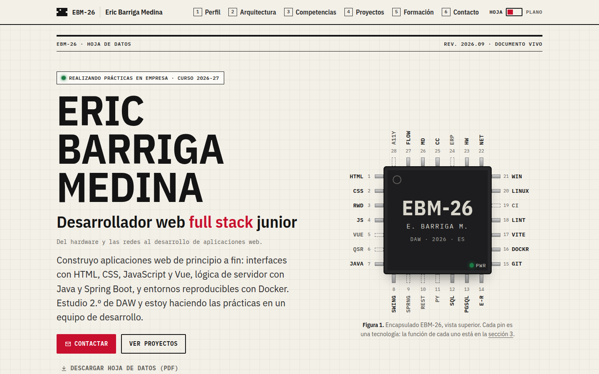
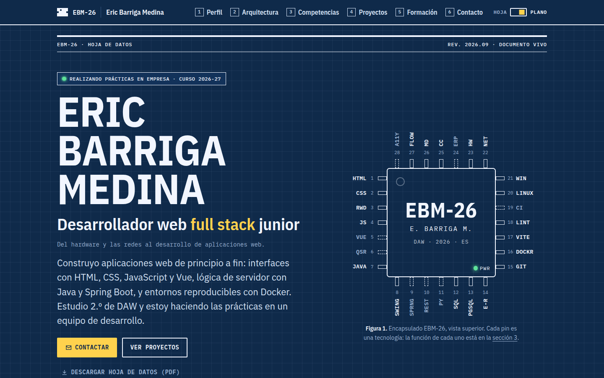
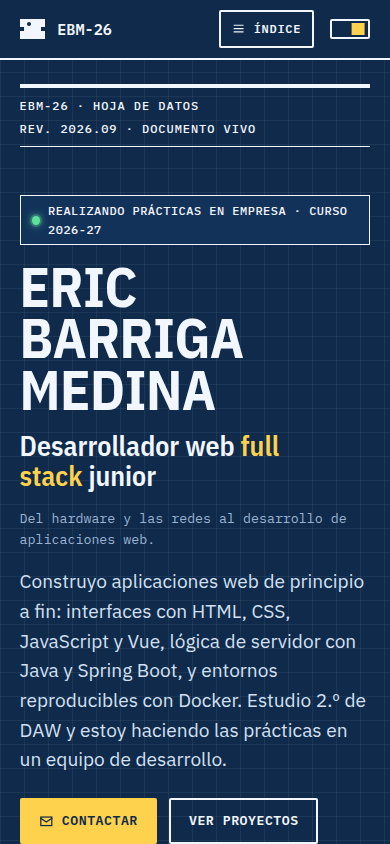
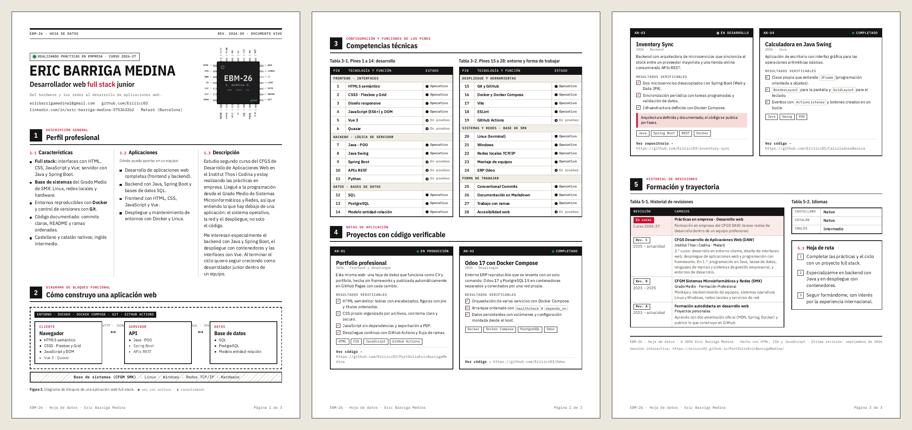

# EBM-26 · Portfolio profesional de Eric Barriga Medina

[](https://github.com/Eriiicc03/PortfolioEricBarrigaMedina/actions/workflows/deploy.yml)


Mi portfolio y currículum presentados como **la hoja de datos (datasheet) de un chip electrónico**.
Yo soy el componente **EBM-26**: cada pin del chip es una tecnología que domino y cada apartado de la
hoja cuenta una parte de mi perfil. Una empresa puede entender quién soy en segundos y comprobar,
con proyectos reales enlazados a su código, lo que sé hacer.

### 🔗 Web publicada: **[eriiicc03.github.io/PortfolioEricBarrigaMedina](https://eriiicc03.github.io/PortfolioEricBarrigaMedina/)**



---

## Índice

1. [Objetivo](#objetivo)
2. [La idea: una hoja de datos](#la-idea-una-hoja-de-datos)
3. [Tecnologías](#tecnologías)
4. [Características](#características)
5. [Estructura del proyecto](#estructura-del-proyecto)
6. [Cómo visualizarlo en local](#cómo-visualizarlo-en-local)
7. [Cómo editar la web a mano](#cómo-editar-la-web-a-mano)
8. [Despliegue](#despliegue)
9. [Flujo de trabajo con Git y versiones](#flujo-de-trabajo-con-git-y-versiones)
10. [Calidad y validación](#calidad-y-validación)
11. [Autor y licencia](#autor-y-licencia)

---

## Objetivo

Práctica **PR01 · Portfolio profesional** del módulo *0614 · Despliegue de aplicaciones web*
(CFGS Desarrollo de Aplicaciones Web, Institut Thos i Codina).

El objetivo es un sitio que:

- Transmita una **identidad profesional propia**, diferente a la típica plantilla de portfolio.
- Funcione como **CV**: presentación, perfil, competencias, formación, idiomas y contacto.
- Aporte **evidencias verificables**: cada proyecto enlaza a su repositorio y lista qué se puede comprobar en el código.
- Se consulte bien desde el **móvil** y se mantenga **vivo**, añadiendo proyectos a medida que los hago.

## La idea: una hoja de datos

Vengo del Grado Medio de Sistemas Microinformáticos y Redes (hardware y redes) y he llegado al desarrollo
web full stack. Para contarlo, la web imita la documentación técnica de un componente electrónico:

| Sección de la web | Apartado de una hoja de datos | Qué contiene |
| :-- | :-- | :-- |
| **Portada** | Primera página + dibujo del encapsulado | Nombre, puesto, estado actual y el **chip EBM-26** con 28 pines (Figura 1). |
| **1 · Perfil** | Descripción general | *Características*, *Aplicaciones* (dónde puedo aportar) y *Descripción*, más una tabla de datos rápidos. |
| **2 · Arquitectura** | Diagrama de bloques funcional | Cómo construyo una aplicación: cliente ⇄ servidor ⇄ datos, sobre Docker y una base de sistemas. |
| **3 · Competencias** | Configuración de pines | Tablas con la función y el estado de cada pin (tecnología): *Operativo* o *En pruebas*. |
| **4 · Proyectos** | Notas de aplicación (AN-01…) | Proyectos reales con esquema, resultados verificables, tecnologías y enlace al código. |
| **5 · Formación** | Historial de revisiones | Formación y trayectoria como revisiones del documento, idiomas y hoja de ruta. |
| **6 · Contacto** | Información de pedido | Correo, LinkedIn, GitHub y el decodificador del código de referencia **EBM-26-DAW-FS**. |

Hay dos temas visuales: **Hoja** (papel técnico, claro) y **Plano** (cianotipo azul, oscuro). En el tema Plano
el chip se convierte en su dibujo técnico hecho solo con líneas.

<p align="center">
  
</p>

## Tecnologías

- **HTML5 semántico**: `header`, `nav`, `main`, `section`, `article`, `figure` con `figcaption`, tablas con `caption`, `thead`, `th scope` y grupos `tbody`.
- **CSS3 propio**, sin frameworks: variables, Grid, Flexbox, tipografía fluida con `clamp()`, `color-mix()`, `writing-mode`, unidades `em` y `ch` para los dibujos, `@media (prefers-color-scheme)`, `@media (prefers-reduced-motion)` y hoja de impresión con `@page`.
- **JavaScript** (ES2020+) sin librerías.
- **GitHub Actions** + **GitHub Pages** para validar y publicar automáticamente.
- **html-validate** para comprobar el HTML en cada push.
- Tipografía **IBM Plex** (Sans, Sans Condensed y Mono), alojada en el propio proyecto (licencia SIL OFL 1.1).

No hay paso de compilación: el código del repositorio es exactamente el que se publica.

## Características

- 🔲 **Chip de 28 pines dibujado solo con HTML y CSS**. Al pulsar un pin, la página salta a la fila de esa tecnología en la tabla.
- 🌗 **Tema Hoja / Plano** que respeta el modo del sistema y recuerda la elección.
- 📄 **PDF con aspecto de datasheet**: el botón *Descargar hoja de datos (PDF)* genera un documento A4 de tres páginas con el pie "Página X de 3" y las URL de los repositorios.
- 📱 **Responsive**: probado en anchos de 360, 390, 768, 992, 1024, 1200, 1280 y 1440 px, sin desbordamiento horizontal.
- ♿ **Accesible**: tablas con encabezados, figuras con pie, foco visible, enlace para saltar al contenido, menú móvil con `aria-expanded`, sección activa con `aria-current`, contraste AA en los dos temas, animaciones desactivables y todo el contenido disponible **sin JavaScript**.
- ⚡ **Rápido**: fuentes propias con precarga y fuentes de reserva con medidas ajustadas (sin saltos de maquetación), ningún recurso externo.
- 🔎 **SEO**: metadatos, Open Graph con imagen para LinkedIn, datos estructurados `schema.org/Person`, `sitemap.xml` y `robots.txt`.
- 🚧 **Página 404** temática: "Pin no conectado".

<p align="center">
  
</p>

**Hoja de datos en PDF generada desde la web:**



## Estructura del proyecto

```text
.
├── index.html                 # Toda la web: textos, chip, tablas y proyectos
├── 404.html                   # Página de error "Pin no conectado"
├── css/
│   ├── fuentes.css            # Fuentes IBM Plex y fuentes de reserva
│   ├── variables.css          # Colores, tamaños y espacios (temas Hoja y Plano)
│   ├── base.css               # Estilos de las etiquetas HTML y utilidades
│   ├── estructura.css         # Cabecera, portada, secciones, contacto y pie
│   ├── componentes.css        # Botones, tablas, tarjetas de proyecto, listas...
│   ├── chip.css               # El chip de la portada (Figura 1)
│   ├── diagramas.css          # Diagrama de bloques, esquemas y decodificador
│   └── impresion.css          # Versión PDF (hoja de datos A4)
├── js/
│   └── principal.js           # Tema, menú móvil, sección activa, copiar, PDF
├── assets/
│   ├── fuentes/               # Archivos .woff2 de IBM Plex
│   └── img/                   # Favicon, icono para móvil e imagen para redes
├── docs/                      # Capturas de este README (no se publican)
├── .github/workflows/
│   └── deploy.yml             # Validación del HTML y publicación en GitHub Pages
├── .htmlvalidate.json         # Reglas del validador de HTML
├── .editorconfig              # Formato común para cualquier editor
├── robots.txt
└── sitemap.xml
```

### Nombres de clases

Todas las clases, ids y variables están en castellano y siguen el formato **BEM**
(`bloque__elemento--variante`):

| Ejemplo | Qué es |
| :-- | :-- |
| `.proyecto` | Bloque: una tarjeta de proyecto. |
| `.proyecto__titulo` | Elemento: el título dentro de la tarjeta. |
| `.proyecto__estado--desarrollo` | Variante: el estado "En desarrollo". |

El JavaScript no depende de las clases, sino de atributos `data-` (`data-boton-tema`, `data-copiar`,
`data-imprimir`, `data-aparecer`…). Así se pueden cambiar los estilos sin romper la interactividad.

## Cómo visualizarlo en local

No necesita instalación ni compilación:

```bash
git clone https://github.com/Eriiicc03/PortfolioEricBarrigaMedina.git
cd PortfolioEricBarrigaMedina
```

**Opción 1 · Abrir el archivo.** Doble clic en `index.html`.

**Opción 2 · Servidor local (recomendado)**, que se comporta igual que en producción:

```bash
python3 -m http.server 8000
```

y abrir <http://localhost:8000>. También sirve la extensión *Live Server* de VS Code.

## Cómo editar la web a mano

Todo el código está comentado en castellano. Estos son los cambios más habituales:

**Cambiar un texto.** Busca el texto en `index.html` y cámbialo. Cada sección empieza con un comentario
grande (`1 · PERFIL`, `4 · PROYECTOS`…) para encontrarla rápido.

**Cambiar los colores o tamaños.** Todo está en `css/variables.css`. Por ejemplo, `--color-acento`
es el rojo del tema Hoja y el amarillo del tema Plano.

**Añadir un proyecto.** En `index.html`, dentro de `<div class="proyectos">`, copia un
`<article class="proyecto">` completo y cambia:

1. El código (`AN-05`) y el estado: `proyecto__estado--publicado`, `--completado` o `--desarrollo`.
2. Título, año, descripción, resultados verificables y tecnologías.
3. El enlace al repositorio.
4. El dibujo `proyecto__esquema` es opcional: puedes reutilizar los que hay o borrarlo.

**Añadir o cambiar una tecnología (un pin).** Hay que tocar dos sitios con el mismo número:

1. La fila de la tabla en la sección 3 (`<tr id="pin-N">`). El estado es `estado-pin` (Operativo)
   o `estado-pin estado-pin--pruebas` (En pruebas).
2. El pin del chip en la portada (`<li class="pin">`, con `pin--pruebas` si está en pruebas).
   El nombre corto debe tener 5 letras como máximo.

**Añadir una etapa de formación.** En la tabla de la sección 5, copia una fila `<tr>` y ponla arriba
(la más reciente va primero).

**Actualizar la fecha.** Cambia *Última revisión* en el pie de `index.html` y `<lastmod>` en `sitemap.xml`.

Después de editar, comprueba el HTML con `npx html-validate@9 index.html 404.html`.

## Despliegue

La web se publica en **GitHub Pages** con **GitHub Actions** ([`.github/workflows/deploy.yml`](.github/workflows/deploy.yml)):

1. En cada *push* o *pull request* a `main` o `develop` se **valida el HTML**.
2. Solo en `main`, si la validación pasa, se copian los archivos públicos a `_site/` y se **publica**.

El estado de cada despliegue se ve en la pestaña [Actions](https://github.com/Eriiicc03/PortfolioEricBarrigaMedina/actions) del repositorio.

### Publicarlo por primera vez

1. El repositorio `PortfolioEricBarrigaMedina` debe ser **público** (GitHub Pages gratuito lo necesita).
2. Subir el código, las ramas y las etiquetas:

   ```bash
   git push -u origin main develop --tags
   ```

3. En el repositorio: **Settings → Pages → Build and deployment → Source: GitHub Actions**.
4. Lanzar el workflow (*Actions → Validar y desplegar → Run workflow*) o hacer un nuevo push a `main`.

## Flujo de trabajo con Git y versiones

| Rama | Uso |
| :-- | :-- |
| `main` | Versión publicada. Cada push despliega la web. |
| `develop` | Rama de integración donde se prueban los cambios. |
| `feature/*`, `fix/*`, `docs/*` | Ramas cortas para cada tarea, integradas en `develop` con `git merge --no-ff`. |
| `diseno-clasico` | Guarda el primer diseño del portfolio (antes de la hoja de datos). |

Los mensajes de commit siguen **[Conventional Commits](https://www.conventionalcommits.org/es/)**
(`feat`, `fix`, `style`, `perf`, `docs`, `ci`, `chore`) y cada versión publicada lleva una etiqueta:

| Etiqueta | Versión |
| :-- | :-- |
| `v1.0.3` | Último estado del diseño clásico. |
| `v2.0.0` | Rediseño "Hoja de datos EBM-26". |

**Volver al diseño anterior**, si hiciera falta:

```bash
git switch diseno-clasico   # solo para verlo (luego: git switch main)
```

```bash
git switch main && git revert --no-edit -m 1 v2.0.0   # deshacer el rediseño con un commit nuevo
```

## Calidad y validación

- **HTML**: `npx html-validate@9 index.html 404.html` → sin errores (también se ejecuta en cada push).
- **Lighthouse** (Chrome, servidor local, septiembre de 2026):

  | | Rendimiento | Accesibilidad | Buenas prácticas | SEO |
  | :-- | :-: | :-: | :-: | :-: |
  | Escritorio | 100 | 100 | 100 | 100 |
  | Móvil | 95 | 100 | 100 | 100 |

- **Sin saltos de maquetación** (CLS 0) gracias a las fuentes de reserva ajustadas.
- **Sin JavaScript** todo el contenido y la navegación siguen funcionando.

## Autor y licencia

**Eric Barriga Medina** · Estudiante de 2.º de DAW

- ✉️ [ericbarrigamedina1@gmail.com](mailto:ericbarrigamedina1@gmail.com)
- 💼 [LinkedIn](https://www.linkedin.com/in/eric-barriga-medina-5753632b2/)
- 🐙 [GitHub](https://github.com/Eriiicc03)

El **código** se distribuye bajo licencia [MIT](LICENSE). Los **textos y datos personales** son
© Eric Barriga Medina. Las fuentes IBM Plex mantienen su licencia SIL Open Font License 1.1.
